# Úvod do code review

 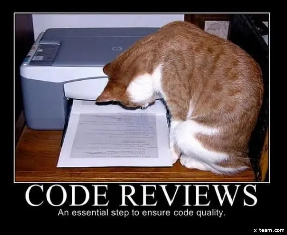  

Průběžně bude zadáno šest úkolů na doma. V prvních pěti si vytvoříte vlastní stránku s hrou Piškvorky. V posledním dáte dohromady v týmu malý přehled o vás a vašem závěrečném projektu.

Jednotlivé domácí úkoly budou zadány postupně na konci některých lekcí nebo ve zprávě přes Slack. Kromě samotného zadání k vypracování se dozvíte i datum, do kdy je potřeba úkola vypracovat.

## Piškvorky

V rámci prvního úkolu ve svém GitHub účtu založíte nový veřejný repozitář. Práci s GitHubem si ukážeme na lekci Git 1. V tomto repozitáři budete řešit průběžně prvních pět úkolů.

Piškvorkové úkoly mají tři fáze. V první vypracujete zadání. Typicky se bude jednat o psaní HTML, CSS a JavaScriptu. V druhé fázi si vyzkoušíte code review, zpětnou vazbu, ve které bude vaším úkolem si přečíst kód jiné účastnice, kterou vám náhodně přiřadíme. Na GitHubu do komentářů jí napíšete, co se vám v kódu líbí nebo na vás udělalo dojem, případně také, co se vám nezdá a co není srozumitelné. Review zakončíte nějakým stručným shrnujícím komentářem. V poslední fázi si projdete komentáře k vašemu kódu napsala jiná účastnice. GitHub vám bude posílat e-maily s oznámením. Odpovězte, kde to dává smysl, případně doupravte kód. Občas na komentář stačí reagovat pomocí emoji na znamení, že ho berete na vědomí. Pokud si s něčím nebudete vědět rady, vždycky se můžete ozvat na Slacku nebo v komentářích zmínit konkrétního kouče/lektora pomocí zavináče, aby mu/jí přišlo upozornění. Pokud po prvním kole komentářů a odpovědí zůstanou nějaké diskuze otevřené, můžete je volitelně dořešit. Typické review v praxi může probíhat i v několika kolech.

V týmech, v zaměstnání se code review na projektech dělá běžně. Předchází se tím chybám, víc očí víc vidí, ale také pomáhá udržovat přehledný kód, ve kterém se vyzná širší tým nebo někdo, kdo po vás bude práci přebírat. Zároveň pomáhá všem prohlubovat jejich znalosti, umět se o problémech bavit a objevovat nové způsoby řešení.

## Microsite o projektu

Poslední úkol vypracujete v týmu, do nového repozitáře budete psát kód ve dvou. Každá z vlastního počítače. Kromě review si tedy vyzkoušíte prokročilejší práci s gitem, což vám poslouží jako příprava na závěrečný projekt. Výsledkem bude webová stránka, na které bude něco o vás a o projektu, který byste měly tou dobou mít už částečně rozmyšlený. Hotový kód vám projde kouč nebo lektor a případně okomentuje.

## Code review

Nástrojů a konvencí pro dobré review je spoustu. Některé postupy budou jiné na GitHubu, Gitlabu či Bitbucketu, další se budou lišit podle velikosti týmu a lokálních zvyklostí. Domluvíme se tedy proto, podle čeho se budeme řídit my.

Hlavním stavebním kamenem všech reviews jsou komentáře. Na GitHubu můžete psát obecné k jednotlivým commitům a konkrétní k upraveným řádkům. Pro review piškvorek postupujte takto:

### Napište review

1. Otevřete si odkaz na repozitář účastnice, pro kterou děláte review.

1. V sekci About najděte odkaz na GitHub pages, na kterém si prohlídněte, jak vypadá, jak se chová výsledná stránka.

   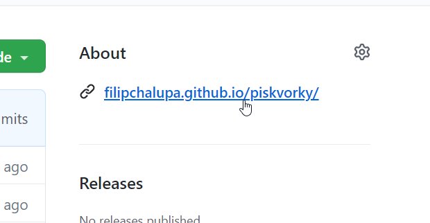

1. Projděte si výsledný kód na GitHubu nebo ve vývojářských nástrojích prohlížeče.

   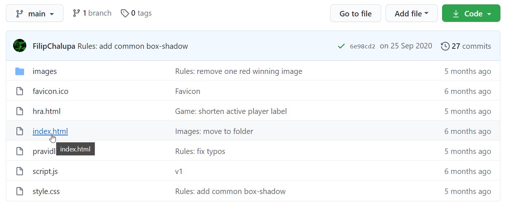

   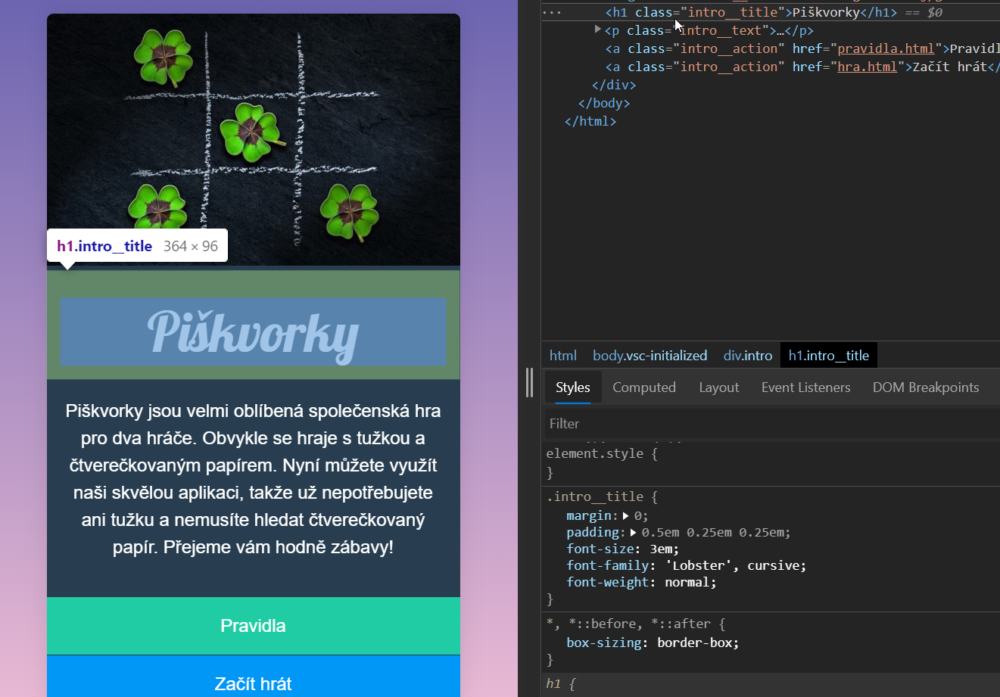

1. Najděte commit a řádek, který chcete okomentovat.

   - Projděte všechny commity.

     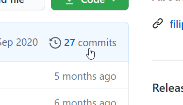

   - Nebo najděte commit, ve kterém byl kus kódu upravený pomocí funkce Blame v detailu soboru na GitHubu.

     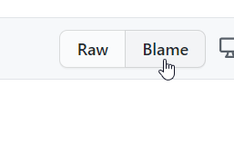

     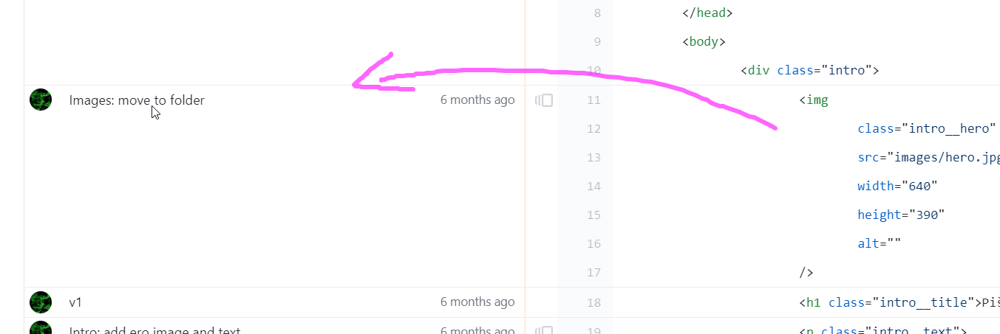

1. Přidejte ke konkrétnímu řádku komentář, který popisuje, co navrhujete opravit, co vás překvapilo, tip pro příště, co se vám líbí.

   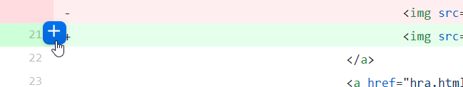

   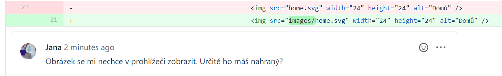

1. Kolik řádků okomentujete, je na vás.

   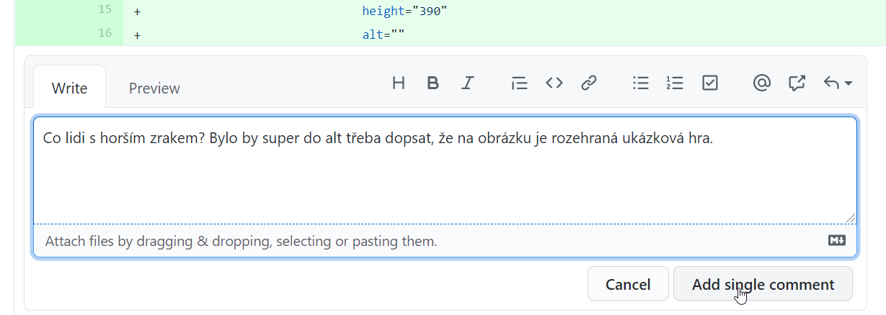

   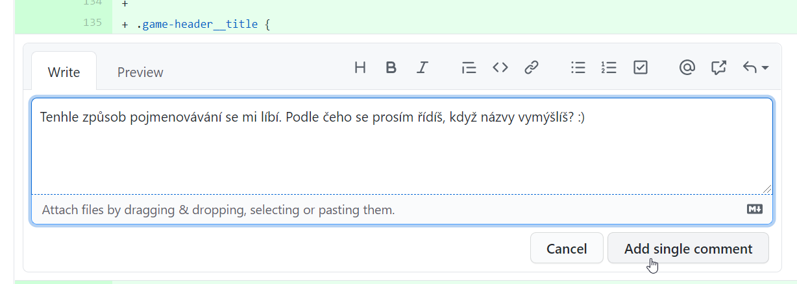

1. Na závěr dopiště do nejnovějšího commitu na jeho konec shnující zprávu, ze které bude poznat, že máte hotovo.

   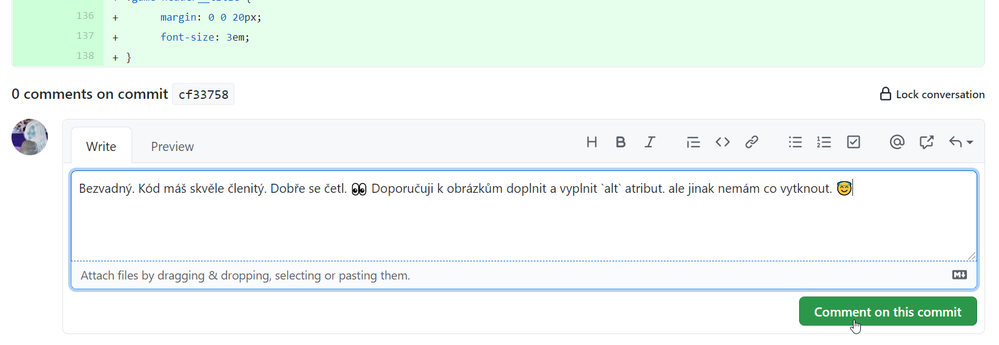

### Odpovězte na review

1. Pokud někdo okomentuje váš kód, měl by vám přijít e-mail.

1. Pročtěte si všechny zprávy, které dostanete.

1. Pokud to dává smysl, můžete váš kód podle nich upravit a donahrát na GitHub v nových commitech.

1. Na jednotlivé komentáře zareagujte. Někde si možná vystačíte s jednoduchým emoji 👍. Jinde bude vhodné se trochu rozepsat.

   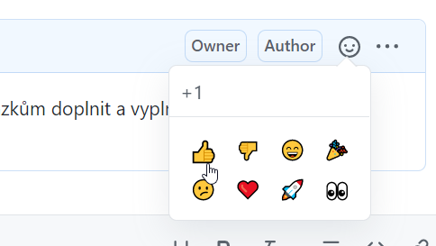

   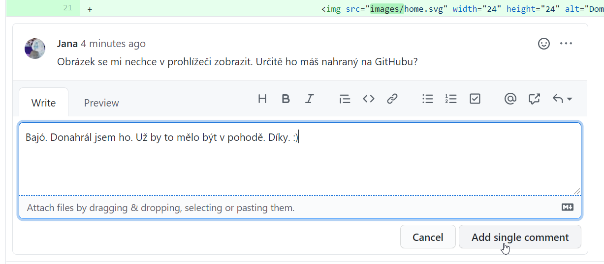

   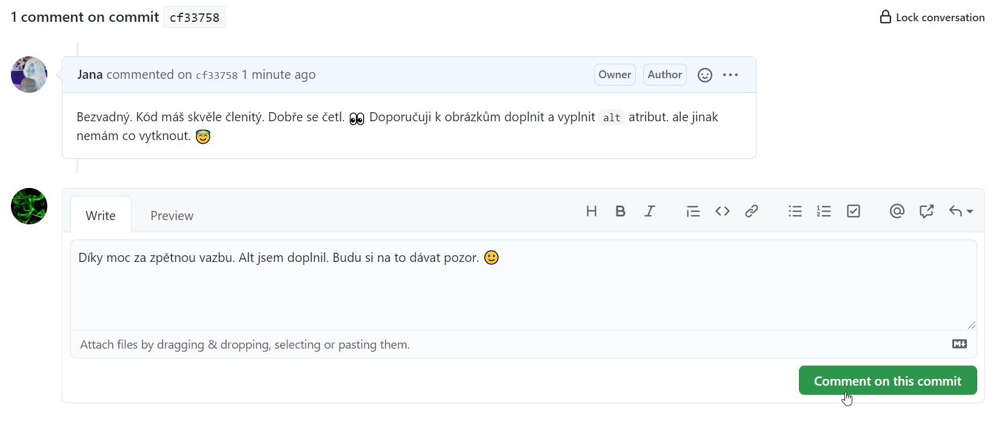

### Něco navíc

Společně s code review se po akademii setkáte i s dalšími souvisejícími pojmy, které můžete volitelně prozkoumat, pokud se chcete ponořit více do hloubky. Jejich znalost však pro vypracování úkolů výše není potřeba.

- Větve: umožňují rozdělanou práci v gitu více strukturovat.
- Pull/merge requesty: průvodci začleněním větve do hlavního kódu. Seskupují diskuze o novém kódu na GitHubu, Gitlabu, … k sobě.
- CI: nástroje pro automatickou, strojovou kontrolu nového kódu.
